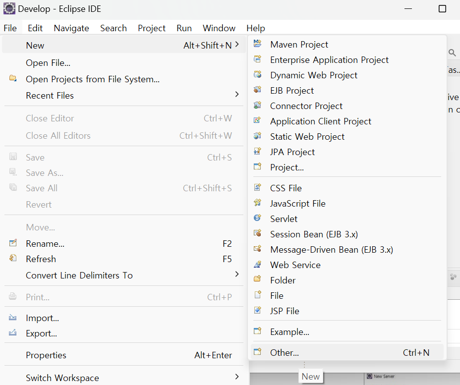
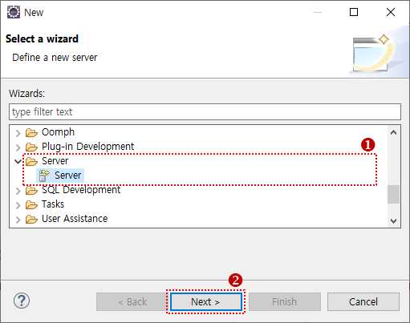
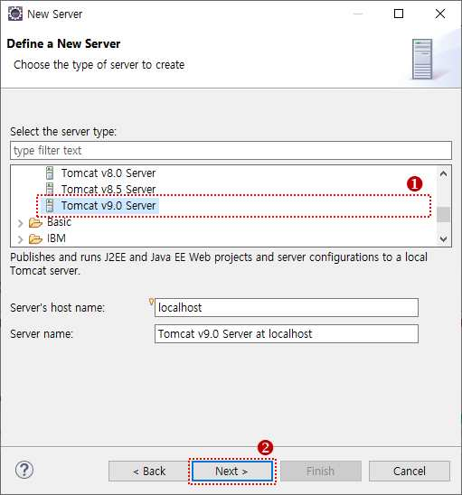
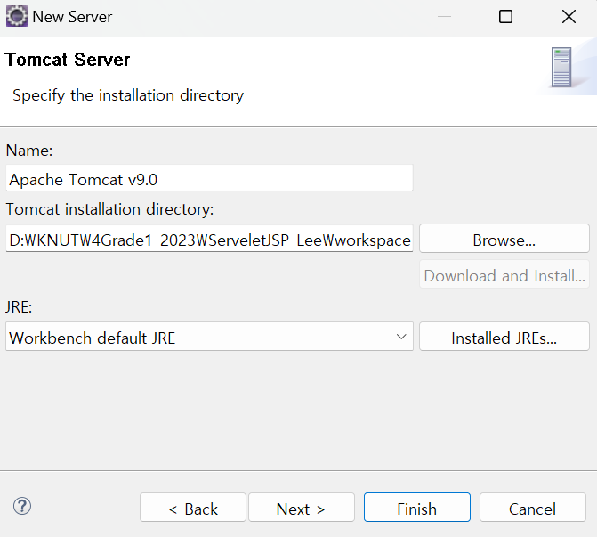
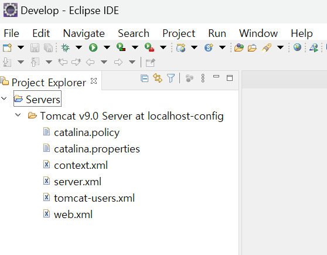
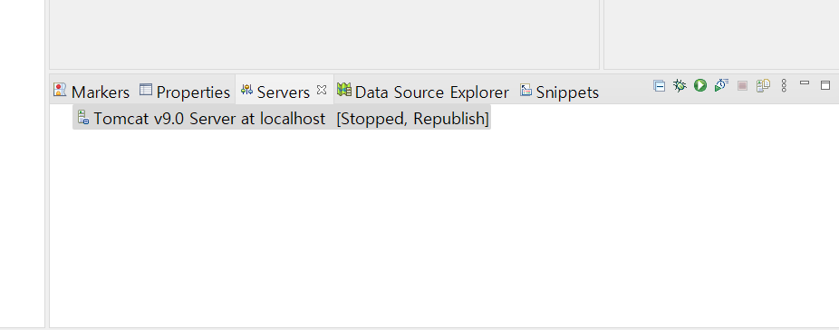

# Project 01. connect server to eclipse

### **핵심요약** 
#### 이클립스와 톰캣을 연동하여 개발 툴과 서버툴 연동을 진행한다.     

### **사용한 이클립스 사양**
#### ♣ Eclipse 2020-09 버전 
#### ♣ Eclipse IDE for Enterprise Java Developers 64비트 Windows Packcage
  

#### **이클립스 설치 링크** 
#### https://www.eclipse.org/downloads/packages/release/2020-09/r
  

### **사용한 톰캣 사양**
#### ♣ Tomcat 9 version 
#### ♣ apache-tomcat-9.0.62
  

#### **톰캣 설치 링크** 
#### https://tomcat.apache.org/download-90.cgi
  

---

  

### ● **이클립스와 톰캣 연동**
  

#### **[Step1]** 
####  [File] - [New] - [Other]를 실행한다.
</img>
  

#### **[Step2]** 
####  [Select a wizard] 창에서 [Server]의 Server를 선택한 후 [Next] 버튼을 클릭한다. 
</img>
  

#### **[Step3]** 
####  Apache를 선택한 다음 “Tomcat v9.0 Server”를 선택하고 [Next] 버튼을 클릭한다.
</img>
  

#### **[Step4]** 
####  [Browser..] 버튼을 클릭한 후 톰캣이 설치되어 있는 폴더를 선택한 다음 [Finish] 버튼을 클릭한다. 
</img>
  

#### **[Step5]** 
####  이클립스의 Project Explorer에 톰캣 서버가 포함된 것을 확인할 수 있다. 
</img>
  

#### **[Step6]** 
####  하단의 [Server] 탭에도 톰캣 서버가 나타난다. 
</img>
  

---