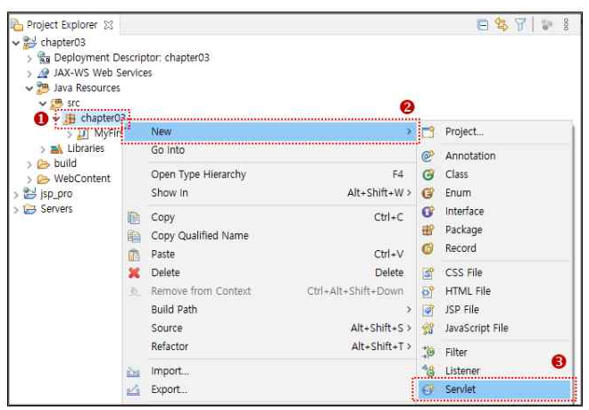

# Chapter 03. JSP_Pro & test.jsp 

### **학습목표** 
#### 서블릿의 구조와 동작을 이해하고, 서블릿이 생성되고 실행된 다음 소멸하기까지의 생명주기를 학습한다. 서블릿을 실행하기 위한 매핑 방법을 학습하고, 애플리케이션과 서블릿의 실행에 자주 사용되는 ServletContext 객체와 ServletConfig 객체를 학습한다.   <br></br>

---

<br></br>

### ● **동적 웹 프로젝트 생성**
<br></br>

#### **[Step1]** 
####  이클립스의 [File] - [New] - [Dynamic Web Project]를 실행한다. 
</img>
<br></br>

#### **[Step2]** 
####  [Project name]에 프로젝트 이름을 **[chapter03]** 지정한다. 
</img>
<br></br>

#### **[Step3]** 
####  ✔️ Context root와 Content directory는 기본값을 사용한다. 
####  ❗ 중앙의 **Generate web.xml deployment descriptor 항목을 반드시 체크해** web.xml(배포 서술자) 문서를 생성해야 한다. (애플리케이션의 설정을 수행하는 web.xml 문서는 애플리케이션 당 하나가 생성되기 때문이다.) 
</img>
<br></br>

#### **[Step4]** 
####  Project Explorer에 [chapter03] 동적 프로젝트가 생성된 것을 확인한다.  
</img>
<br></br>


---

<br></br>

### ● **클래스 패스 지정**
#### 서블릿 API 라이브러리는 톰캣의 servlet-api.jar 파일로 제공되므로 클래스 패스를 지정해야 서블릿 API를 사용할 수 있다. servlet-api.jar 파일은 톰캣 설치 폴더 내의 lib 폴더에 존재한다. 
<br></br>

#### **[Step1]** 
#### ① chapter03 프로젝트를 선택하고 우클릭하여 ② [Build Path] 항목을 선택한 다음 ③ [Configure Build Path...]를 선택한다. 

</img>
<br></br>

#### **[Step2]** 
#### ① [Libraries] 탭을 선택한다. ② [Classpath]를 선택한 다음 ③ [Add External JARs...]를 선택한다. 
</img>
<br></br>

#### **[Step3]**
####  ① 톰캣 설치 폴더의 lib 폴더로 이동한 다음 ② servlet-api.jar 파일을 선택하고 ③ [열기] 버튼을 클릭한다.
</img>
<br></br>

#### **[Step4]**
####  [Apply and Close] 버튼을 클릭한다
</img>
<br></br>

---

<br></br>

### ● **패키지와 서블릿 클래스 생성**
#### 모든 서블릿 클래스는 반드시 패키지 내에 구현되어야 한다. 따라서 서블릿 클래스를 구현할 패키지를 먼저 생성한다. 

<br></br>

#### **[Step1]** 
#### ① [chapter03]-[Java Resources]-[src]를 선택한 다음 마우스 오른쪽 버튼으로 단축 메뉴를 실행한다. 
#### ② [New] 항목을 선택한 다음 ③ [Package]를 선택한다. 
</img>
<br></br>

#### **[Step2]** 
#### 패키지 이름은 chapter03으로 지정하고 [Finish] 버튼을 클릭한다.
</img>
<br></br>

#### **[Step3]**
####  chapter03 패키지가 생성된 것을 확인한다. 
</img>
<br></br>

#### **[Step4]**
####  ① [src]를 선택한 다음 마우스 오른쪽 버튼을 클릭해 단축 메뉴를 실행한다. 
####  ② [New] 항목을 선택하고, ③ [Class]를 선택한다.
</img>
<br></br>

#### **[Step5]**
####  클래스의 이름을 MyFirstServlet로 지정하고 [Finish] 버튼을 클릭한다. 
</img>
<br></br>

#### **[Step6]**
####  클래스의 이름을 MyFirstServlet로 지정하고 [Finish] 버튼을 클릭한다. 
</img>
<br></br>

#### **실습 01. MyFirstServlet**
```java
package chapter03;

import java.io.IOException;

import javax.servlet.ServletException;
import javax.servlet.http.HttpServlet;
import javax.servlet.http.HttpServletRequest;
import javax.servlet.http.HttpServletResponse;

// MyFirstServlet은 HttpServlet을 상속받는다.
public class MyFirstServlet extends HttpServlet{

	private static final long serialVersionUID = 1L;
	
	// 16번 라인부터 18번 라인은 init 메서드 구현 / servlet 생성시 단 한번 실행  
	public void init() throws ServletException {
		System.out.println("init 메서드가 수행되었습니다.");
	}
	
	// 22번 라인부터 25번 라인은 doGet 메서드 구현 /doPost와 doGet 중 기본값은 doGet 
	// doGet은 HttpServletRequest와 HttpServletResponse 객체를 service로부터 전달 받음 
	protected void doGet(HttpServletRequest req, HttpServletResponse res)    
			throws ServletException, IOException {
		System.out.println("doGet 메서드가 수행되었습니다.");
	}
	
	// 28번 라인부터 30번 라인은 destroy 메서드 구현 / 웹 서버 종료시 단 한번 실행 
	public void destroy() {
		System.out.println("destroy 메서드가 수행되었습니다.");
	}
	
}
```

<br></br>

---

<br></br>

### ● **URL 매핑**
#### 서블릿을 실행하려면 서블릿에 매핑 이름을 부여하고 URL과 매핑 이름을 함께 사용해야 한다. 
#### ❗  일반적으로 서블릿의 이름과 매핑의 이름을 다르게 지정한다. (서블릿의 이름과 매핑의 이름을 같게 지정한다면 서블릿의 이름이 URL에 노출되므로 보안에 문제가 발생할 수 있기 때문이다.)
<br></br>

### ● **web.xml 문서를 이용한 URL 매핑**
#### web.xml 문서에 servlet 태그와 servlet-mapping 태그를 이용해 매핑 정보를 지정한다.
<br></br>

#### ⏩  servlet 태그 
#### servlet 태그에는 매핑하는 서블릿 클래스의 이름을 지정한다. 
#### →  servlet-name 태그는 web.xml 문서에 하나 이상의 매핑이 존재할 때, 매핑을 구분하기 위한 식별자로 사용된다. 
#### →  servlet-class 태그는 패키지를 포함하는 서블릿 클래스의 이름을 지정한다.  ex) chapter03.MyFirstServlet
<br></br>

#### ⏩ servlet-mapping 태그 
#### servlet-mapping 태그에는 서블릿의 매핑 정보를 지정한다. 
#### → servlet-name 태그에는 servlet 태그의 servlet-name 태그와 같은 이름을 지정한다. 
#### → url-mapping 태그에는 URL 매핑 이름을 지정한다. URL 매핑의 이름은 /문자로 시작해야 한다.   ex) /First
<br></br>

#### **실습 02. web.xml 문서에 매핑**
```xml
<?xml version="1.0" encoding="UTF-8"?>
<web-app xmlns:xsi="http://www.w3.org/2001/XMLSchema-instance" xmlns="http://xmlns.jcp.org/xml/ns/javaee" xsi:schemaLocation="http://xmlns.jcp.org/xml/ns/javaee http://xmlns.jcp.org/xml/ns/javaee/web-app_4_0.xsd" id="WebApp_ID" version="4.0">
  <display-name>chapter03</display-name>
  <welcome-file-list>


    <welcome-file>index.html</welcome-file>
    <welcome-file>index.htm</welcome-file>
    <welcome-file>index.jsp</welcome-file>
    <welcome-file>default.html</welcome-file>
    <welcome-file>default.htm</welcome-file>
    <welcome-file>default.jsp</welcome-file>
  </welcome-file-list>
  
  <servlet>
  	<servlet-name>myServlet</servlet-name>
  	<servlet-class>chapter03.MyFirstServlet</servlet-class>
  </servlet>
  
  <servlet-mapping>
  	<servlet-name>myServlet</servlet-name>
  	<url-pattern>/First</url-pattern>
  </servlet-mapping>
  
</web-app>

```
<br></br>

### ● **MyFirstServlet 서블릿을 실행**
#### 브라우저 표시줄에는 http://localhost:8080/chapter03/First가 출력된다. 
</img>
<br></br>

#### → 현재 서블릿에는 브라우저에 출력하는 구문이 없으므로 아무런 내용도 출력되지 않는다. 하지만, init( )와 doGet( ) 메서드가 수행되므로 하단의 Console 탭에 다음과 같은 내용이 출력된다. 
<br></br>

---

<br></br>

### ● **애너테이션을 이용한 URL 매핑**
#### web.xml 문서를 사용하지 않고 서블릿 클래스 내에 URL 매핑 정보를 직접 지정하는 방식을 말한다.  ✔️ 주로 애너테이션을 이용해 URL 매핑을 지정한다.
<br></br>

#### **[Step1]** 
#### [chapter03 package]-[New]-[Servlet]를 선택한다.
</img>
<br></br>

#### **[Step2]** 
#### 서블릿 클래스의 이름을 MySecondServlet으로 지정한 후 [Next] 버튼을 클릭한다. 
</img>
<br></br>

#### **[Step3]**
####  ① [Description]에 ‘두번째 서블릿’이라는 문자열을 지정한다.	
####  ② [URL Mappings]에서 현재 지정된 매핑 이름인 /MySecondServlet을 선택한 후 ③ [Edit] 버튼을 클릭한다. 
#### ④ [Pattern]에 ‘/Second’를 입력한 후 ⑤ [OK] 버튼을 클릭한다. 
</img>
<br></br>

#### **[Step4]**
####  ① Constructors from superclass 체크를 해제하고 ② doGet과 doPost를 선택하고 ③ [Finish] 버튼을 클릭한다. 
</img>
<br></br>

#### 생성된 MySecondServlet 서블릿 클래스를 다음과 같이 수정하고 실행한다. (자동으로 생성되는 주석은 삭제해도 된다,)
```java
package chapter03;

import java.io.IOException;
import java.io.PrintWriter;

import javax.servlet.ServletException;
import javax.servlet.annotation.WebServlet;
import javax.servlet.http.HttpServlet;
import javax.servlet.http.HttpServletRequest;
import javax.servlet.http.HttpServletResponse;

// description : 설명 , urlPatterns : 매핑 이름을 지정 
@WebServlet(description = "두번째 서블릿", urlPatterns = { "/Second" })
public class MySecondServlet extends HttpServlet {
	private static final long serialVersionUID = 1L;

	protected void doGet(HttpServletRequest request, HttpServletResponse response) 
			throws ServletException, IOException {

		response.setContentType("text/html;charset=utf-8");
		PrintWriter out = response.getWriter();
		
		out.println("<html>");
		out.println("<head>");
		out.println("<title>Second</title>");
		out.println("<body>");
		out.println("<h2>두번째 서블릿입니다.</h2>");
		out.println("</body>");
		out.println("</head>");
		out.println("</html>");
	}

	// 사용자가 doPost로 요청할 때 doGet으로 응답하고자 할 때 사용하는 코드 
	protected void doPost(HttpServletRequest request, HttpServletResponse response) 
			throws ServletException, IOException {
		doGet(request, response);
	}

}

```
</img>
<br></br>

---

<br></br>

### ● **MVC 구조**
#### MVC 패턴을 사용하면 서블릿에서 코드가 길어지는 현상을 해결할 수 있다. MVC 패턴을 사용한다는 것은 프레젠테이션 로직과 비즈니스 로직을 분리해 개발한다는 것을 의미한다. 
<br></br>

#### ✔️ Model : 애플리케이션의 주요 기능을 구현하는 비즈니스 로직을 의미하며 자바 클래스로 구현한다. 
#### ✔️ View : 브라우저에 출력되는 내용을 포함하는 프레젠테이션 로직을 의미하며 JSP로 구현한다. 브라우저에 출력할 내용을 서블릿 내에서 구현하는 것이 아니라 JSP 문서에 전달해 출력한다. 
#### ✔️ Controller : 프레젠테이션 로직과 비즈니스 로직을 제어하는 역할을 하며 서블릿으로 구현한다. 클라이언트의 모든 요청은 Controller로 전달되며, Controller는 요청을 파악해 비즈니스 로직을 수행하거나 프레젠테이션 로직을 수행한다
<br></br>

---

<br></br>

### ● **ServletContext 객체**
#### 서블릿 컨테이너가 시작될 때 애플리케이션마다 고유의 ServletContext 객체가 자동으로 생성된다. (프로젝트 하나당 하나씩 생성되는 객체)  ✔️ 같은 애플리케이션에 속한 서블릿들은 ServletContext 객체를 공유 


<br></br>

### ♣ **ServletContext 파라미터**
#### 같은 애플리케이션에 속한 모든 서블릿들은 ServletContext 객체를 공유하므로, 서블릿 사이에서 공유되어야 하는 데이터들을 ServletContext 객체의 파라미터로 지정하면, 애플리케이션 내의 모든 서블릿들은 데이터를 공유할 수 있게 된다. 
<br></br>

### ▶ **ServletContext 파라미터 생성**
#### web.xml 문서의 'context-param' 태그를 사용해 ServletContext 파라미터를 지정할 수 있다. (하나 이상의 파라미터를 지정하려면 파라미터마다 'context-param' 태그를 사용한다.)
<br></br>

### ● **code 01. web.xml 문서에 user_name과 user_company 라는 두 개의 ServletContext 파라미터를 생성**한다.
```xml
<?xml version="1.0" encoding="UTF-8"?>
<web-app xmlns:xsi="http://www.w3.org/2001/XMLSchema-instance" xmlns="http://xmlns.jcp.org/xml/ns/javaee" xsi:schemaLocation="http://xmlns.jcp.org/xml/ns/javaee http://xmlns.jcp.org/xml/ns/javaee/web-app_4_0.xsd" 
id="WebApp_ID" version="4.0">
  <display-name>chapter03</display-name>
  <welcome-file-list>
    <welcome-file>index.html</welcome-file>
    <welcome-file>index.htm</welcome-file>
    <welcome-file>index.jsp</welcome-file>
    <welcome-file>default.html</welcome-file>
    <welcome-file>default.htm</welcome-file>
    <welcome-file>default.jsp</welcome-file>
  </welcome-file-list>
  
  <servlet>
  	<servlet-name>myServlet</servlet-name>
  	<servlet-class>chapter03.MyFirstServlet</servlet-class>
  </servlet>
  
  <servlet-mapping>
  	<servlet-name>myServlet</servlet-name>
  	<url-pattern>/First</url-pattern>
  </servlet-mapping>
  
  <context-param>
  	<param-name>user_name</param-name>
  	<param-value> 홍길동 </param-value>
  </context-param>
  
  <context-param>
  	<param-name>user_company</param-name>
  	<param-value> 한국주식회사 </param-value>
  </context-param>
  
</web-app>

```
####  →  chapter03 속 모든 서블릿들이 ‘홍길동’ 값과 ‘한국주식회사’ 라는 데이터를 공동으로 사용하고 싶을 때 위와 같은 초기화 파라미터를 지정할 수 있다.
<br></br>

### ● **ServletContext 파라미터 추출**
</img>
<br></br>

### ● **code 02. ServletContext 파라미터를 추출하는 ServletContextParam 서블릿을 생성하고 실행**한다. **URL 패턴의 이름은 /param으로 지정**한다.
```java
package chapter03;

import java.io.IOException;
import java.io.PrintWriter;
import java.util.Enumeration;

import javax.servlet.ServletContext;
import javax.servlet.ServletException;
import javax.servlet.annotation.WebServlet;
import javax.servlet.http.HttpServlet;
import javax.servlet.http.HttpServletRequest;
import javax.servlet.http.HttpServletResponse;

@WebServlet("/param")
public class ServletContextParam extends HttpServlet {
    private static final long serialVersionUID = 1L;
       
    protected void doGet(HttpServletRequest request, HttpServletResponse response) 
    		throws ServletException, IOException {
    	
		response.setContentType("text/html;charset=utf-8");
		PrintWriter out = response.getWriter();
		
		// getServletContext() 메서드를 사용해 현재의 ServletContext 객체를 얻어온다. 
		ServletContext context = this.getServletContext();
		
		// getInitParameterNames() 메서드를 사용해 모든 ServletContext 파라미터의 이름을 추출해 
                  Enumeration 타입으로 반환한다. 
		Enumeration<String> paramNames = context.getInitParameterNames();

		// getInitParameter() 메서드를 사용해 모든 ServletContext 파라미터의 name 값을 추출해 출력한다. 
		while(paramNames.hasMoreElements()) {
			String name = paramNames.nextElement();
			String value = context.getInitParameter(name);
			out.print(name + " : " + value + "<br>");
		}
	}

}
```
</img>
<br></br>

---
<br></br>

### ● **바인딩(Binding)**
#### 바인딩은 데이터를 특정 객체에 속성(Attribute)으로 지정하는 것을 말하며, 객체를 공유하는 문서들은 바인딩 되어 있는 값을 추출해 사용할 수 있다.
<br></br>

### ● **바인딩의 특징**
#### ✔️ web.xml을 건드리지 않고, 서블릿내에서 값을 메서드로 지정하고, 바인딩 된 데이터는 수정하거나 삭제도 가능하다.
#### ✔️ 소스코드를 유지 보수를 효율적으로 하기 위해서 많이 사용한다. 
#### ✔️ 데이터뿐만 아니라 데이터 객체를 바인딩할 수 있다. 
#### ✔️바인딩은 데이터를 특정 객체에 속성을 지정하는 것이므로, 특정 소스코드를 자주 수정해야 할 경우 사용하면 좋다.
<br></br>

### ● **바인딩에 사용되는 주요 메서드**
</img>
<br></br>

### ● **code 03. ServletContextSetAttr.java**
#### 데이터와 객체를 ServletContext 객체에 바인딩하는 ServletContextSetAttr 서블릿을 생성한다. URL 패턴의 이름은 scset으로 지정한다. 

```java
package chapter03;

import java.io.IOException;
import java.util.ArrayList;
import java.util.List;

import javax.servlet.ServletContext;
import javax.servlet.ServletException;
import javax.servlet.annotation.WebServlet;
import javax.servlet.http.HttpServlet;
import javax.servlet.http.HttpServletRequest;
import javax.servlet.http.HttpServletResponse;

@WebServlet("/scset")
public class ServletContextSetAttr extends HttpServlet {
    private static final long serialVersionUID = 1L;
       
    protected void doGet(HttpServletRequest request, HttpServletResponse response) 
    		throws ServletException, IOException {
		response.setContentType("text/html;charset=utf-8");
		
		// getServletContext() 메서드를 사용해 현재의 ServletContext 객체를 얻어온다. 
		ServletContext context = getServletContext();
		
		//ArrayList는 List 인터페이스를 상속받은 클래스로 크기가 가변적으로 변하는 선형리스트
		List person = new ArrayList();
		
		// add 메서드 : ArrayList에 값을 추가하는 메서드
		person.add("이순신");
		person.add("코리아시스템");
		
		// setAttribute(String name, Object object): object를 name이라는 속성으로 바인딩 
		context.setAttribute("person", person);
		context.setAttribute("city", "서울");
	}

}
```
<br></br>

### ● **code 04. ServletContextGetAttr.java**
#### ServletContext 객체에 바인딩되어 있는 데이터와 객체를 추출하는 ServletContextGetAttr 서블릿을 생성한다. URL 패턴의 이름은 scget으로 지정한다. 

```java
package chapter03;

import java.io.IOException;
import java.io.PrintWriter;
import java.util.ArrayList;
import java.util.List;

import javax.servlet.ServletContext;
import javax.servlet.ServletException;
import javax.servlet.annotation.WebServlet;
import javax.servlet.http.HttpServlet;
import javax.servlet.http.HttpServletRequest;
import javax.servlet.http.HttpServletResponse;

@WebServlet("/scget")
public class ServletContextGetAttr extends HttpServlet {
    private static final long serialVersionUID = 1L;
       
    protected void doGet(HttpServletRequest request, HttpServletResponse response) 
    		throws ServletException, IOException {

    	response.setContentType("text/html;charset=utf-8");
    	
    	// 응답으로 내보낼 출력 스트림을 얻는 과정    
	PrintWriter out = response.getWriter();
		
	// getServletContext() 메서드를 사용해 현재의 ServletContext 객체를 얻어온다. 
	ServletContext context = this.getServletContext();
		
	// getAttribute(String name) : 바인딩 되어 있는 name 속성 값을 추출 (ArrayList) 값을 불러옴)
	List person = (ArrayList)context.getAttribute("person");
	String user_name = (String) person.get(0);   // user_name 객체에 person0번 인덱스 값을 가져옴 
	String user_company = (String) person.get(1);   // user_company 객체에 person 1번 인덱스 값을 가져옴 
		
	// user_city 객체에 city 속성값을 가져옴 
	String user_city = (String) context.getAttribute("city");
		
	out.print(user_name + ":" + user_company + "<br>");
	out.print(user_city);
     }
}
```
<br></br>

### ⏩ **ServletContextSetAttr 서블릿을 실행한 결과**
#### ServletContext에 바인딩은 이루어졌지만, 브라우저에 출력하는 구문이 없으므로 아무런 내용도 출력되지 않는다. 
</img>
<br></br>

### ⏩ **ServletContextGetAttr 서블릿을 실행한 결과**
#### ServletContext에 바인딩되어 있는 속성의 값이 브라우저에 출력한다. (ServletContextSetAttr을 먼저 실행해야 오류가 발생하지 않는다.) 
</img>
<br></br>

---
<br></br>

### ● **애플리케이션 정보 추출 관련 주요 메서드**
</img>
<br></br>

### ● **code 05. ServletContextServletInfo.java**
#### ServletContextServerInfo 서블릿 클래스를 생성한다. URL 패턴의 이름은 scinfo로 지정한다.  

```java
package chapter03;

import java.io.IOException;
import java.io.PrintWriter;

import javax.servlet.ServletContext;
import javax.servlet.ServletException;
import javax.servlet.annotation.WebServlet;
import javax.servlet.http.HttpServlet;
import javax.servlet.http.HttpServletRequest;
import javax.servlet.http.HttpServletResponse;

@WebServlet("/scinfo")
public class ServletContextServletInfo extends HttpServlet {
	private static final long serialVersionUID = 1L;
       
	protected void doGet(HttpServletRequest request, HttpServletResponse response) 
			throws ServletException, IOException {
		response.setContentType("text/html;charset=utf-8");
    	         // 응답으로 내보낼 출력 스트림을 얻는 과정 
		PrintWriter out = response.getWriter();
		// getServletContext() 메서드를 사용해 현재의 ServletContext 객체를 얻어온다. 
		ServletContext sc = this.getServletContext();
		
		// getMajorVersion() : 현재 서블릿의 Major 버전을 반환한다. 
		out.print("서블릿 버전 : " + sc.getMajorVersion() + "." + sc.getMinorVersion() + "<br>");
                  // getServerInfo() : 서블릿의 컨테이너의 이름과 버전 정보를 반환 
		out.print("서버 정보 : " + sc.getServerInfo() + "<br>");      
		out.print("애플리케이션 경로 : " + sc.getContextPath() + "<br>");   // 애플리케이션의 경로를 반환
		 // getServletContextName() : ServletContext의 이름을 반환  
		out.print("애플리케이션 이름 : " + sc.getServletContextName() + "<br>"); 
		// getRealPath() : 인자로 지정된 path의 현재 실제 경로를 반환  
		out.print("파일의 실제 경로 : " + sc.getRealPath("/"));   
	}
}
```
<br></br>

---
<br></br>

### ● **ServletConfig 객체**
#### 서블릿마다 생성되는 객체이다. 
<br></br>

### ● **ServletConfig의 특징**
#### ✔️ 클라이언트가 서블릿을 요청하면 서블릿의 인스턴스가 생성된 다음 ServletConfig 객체가 생성된다. 
#### ✔️ServletContext 객체는 서버가 돌면 자동으로 생성되지만, ServletConfig 객체는 클라이언트 요청 시에만 생성된다. 
#### ✔️ ServletConfig 객체도 파라미터를 이용해 초기화 정보를 지정할 수 있다. 
#### ✔️JSP 문서에서는 ServletConfig 객체를 사용하지 않는다. 
<br></br>

### ● **code 06. ServletConfigInit.java**
#### @WebInitParams 애너테이션 파라미터를 지정하여 서블릿의 초기화 정보를 지정한다. 

```java
package chapter03;

import java.io.IOException;
import java.io.PrintWriter;

import javax.servlet.ServletContext;
import javax.servlet.ServletException;
import javax.servlet.annotation.WebServlet;
import javax.servlet.http.HttpServlet;
import javax.servlet.http.HttpServletRequest;
import javax.servlet.http.HttpServletResponse;

// 파라미터가 추가된 @WebServlet 애너테이션 )- 전역변수 생성 / 다른 서블릿에서 참조 불가 
@WebServlet(
		description = "파라미터 지정", 
		urlPatterns = { "/scf1" }, 
		initParams = { 
				@WebInitParam(name = "username", value = "홍길동"), 
				@WebInitParam(name = "usercompany", value = "한국주식회사")
		})

public class ServletConfigInit extends HttpServlet {
	private static final long serialVersionUID = 1L;

	protected void doGet(HttpServletRequest request, HttpServletResponse response) 
		throws ServletException, IOException {
		response.setContentType("text/html;charset=utf-8");
    		// 응답으로 내보낼 출력 스트림을 얻는 과정 
		PrintWriter out = response.getWriter();
		
		// getInitParameter() 메서드를 사용해 모든 ServletContext 파라미터의 name 값을 추출해 출력한다. 
		String name = getInitParameter("username");
		String company = getInitParameter("usercompany");
		
		out.print(name + ":" + company);
	}
}
```
<br></br>
