# Project 02. JSP_Pro & test.jsp 

### **핵심요약** 
#### 동적 웹 프로젝트를 생성해보고, jsp 파일 생성을 하여 웹 페이지에 데이터를 출력해본다.  <br></br>

### **사용한 이클립스 사양**
#### ♣ Eclipse 2020-09 버전 
#### ♣ Eclipse IDE for Enterprise Java Developers 64비트 Windows Packcage
<br></br>

#### **이클립스 설치 링크** 
#### https://www.eclipse.org/downloads/packages/release/2020-09/r
<br></br>

### **사용한 톰캣 사양**
#### ♣ Tomcat 9 version 
#### ♣ apache-tomcat-9.0.62
<br></br>

#### **톰캣 설치 링크** 
#### https://tomcat.apache.org/download-90.cgi
<br></br>

---

<br></br>

### ● **동적 웹 프로젝트 생성**
<br></br>

#### **[Step1]** 
####  이클립스의 [File] - [New] - [Dynamic Web Project]를 실행한다. 
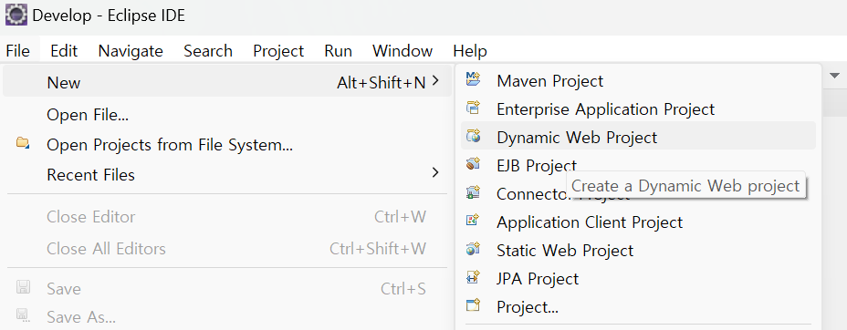</img>
<br></br>

#### **[Step2]** 
####  [Project name]에 프로젝트 이름을 지정한다. 프로젝트 이름은 jsp_pro로 지정한다. 다른 항목들은 기본값을 사용한다. 
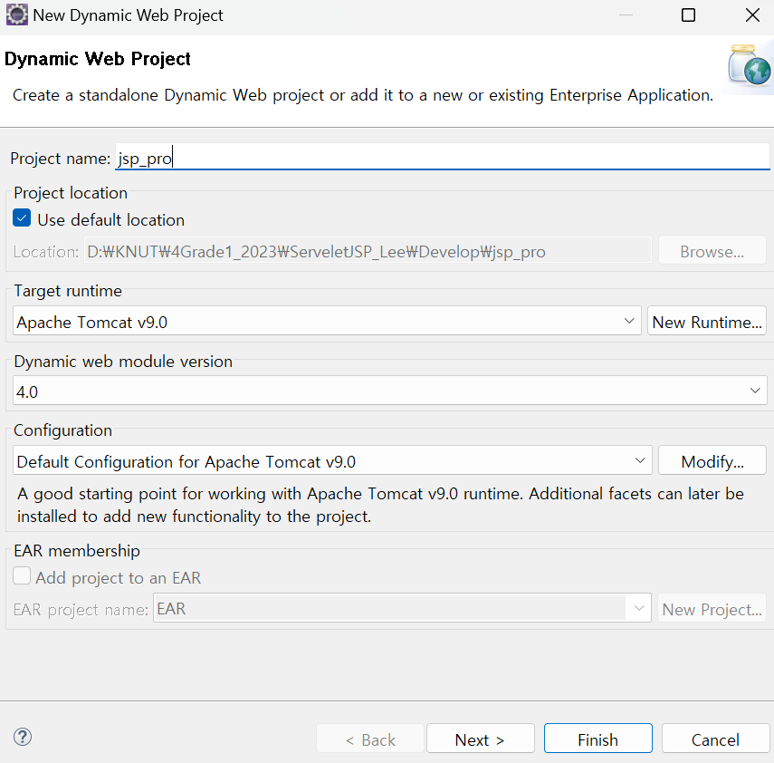</img>
<br></br>

#### **[Step3]** 
####  [Next] 버튼을 클릭한다. 
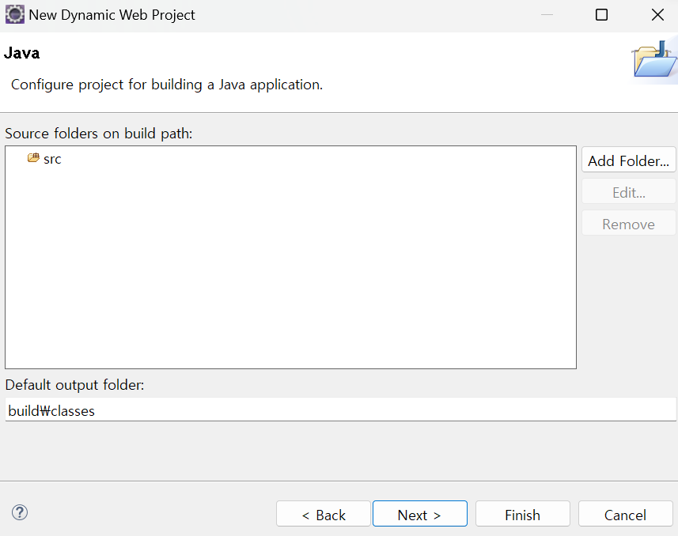</img>
<br></br>

#### **[Step4]** 
####  ✔️  [Context root]는 프로젝트의 이름을 나타내고, [Content directory]는 콘텐츠들이 저장되어 있는 위치를 말한다. 
####  ✔️  프로젝트의 이름은 jsp_pro를 말하고, JSP 파일과 같은 콘텐츠는 WebContent에 저장된다는 것을 의미한다. 
####  ❗ ‘Generate web.xml deployment descriptor’를 반드시 체크 !! -  web.xml은 프로젝트의 환경설정을 위해 사용되며, 프로젝트 당 하나만 생성되는 중요한 파일이다. 
####  ✔️  [Finish] 버튼을 클릭한다.  
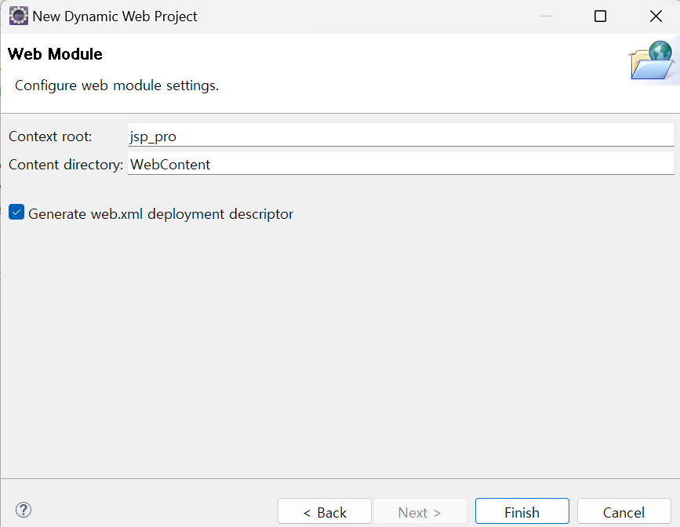</img>
<br></br>

#### **[Step5]** 
####  jsp_pro 동적 웹 프로젝트가 생성된 것을 확인할 수 있다.  
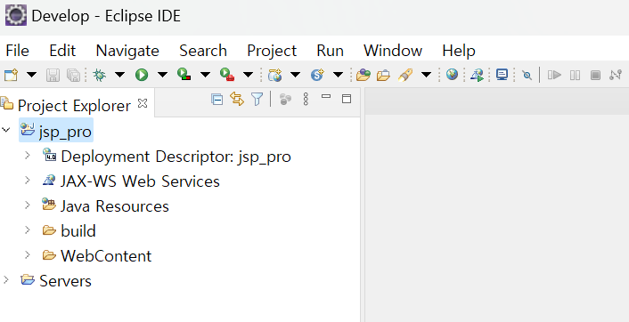</img>
<br></br>

---

<br></br>

### ● **JSP 문서의 작성과 실행**
<br></br>

#### **[Step1]** 
#### ①  jsp_pro 문서에서 [WebContent]를 선택한 다음 마우스 오른쪽 버튼을 클릭해 [New]를 선택한다. 
#### ②  [JSP File]을 선택한다. 

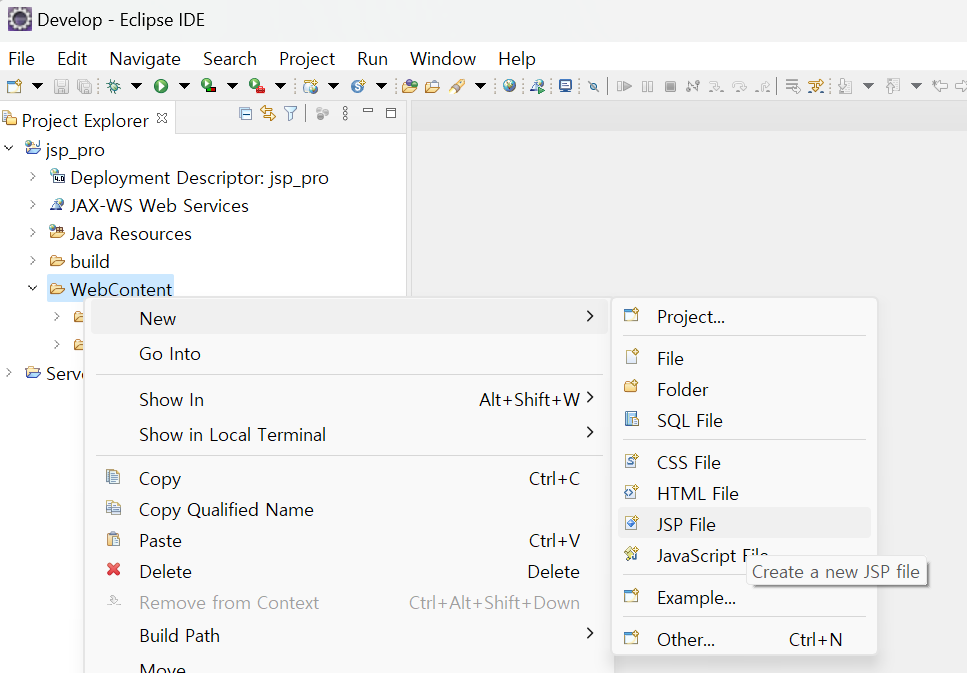</img>
<br></br>

#### **[Step2]** 
#### ①  파일의 이름은 test.jsp로 지정한다. 
#### ②  [Finish] 버튼을 클릭한다. 
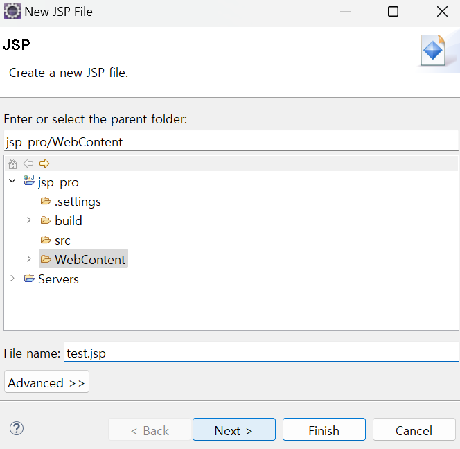</img>
<br></br>

#### **[Step3] test.jsp** 
####  생성된 템플릿에 10번부터 12번 라인의 JSP 구문을 삽입한다. 

```jsp
<%@ page language="java" contentType="text/html; charset=UTF-8" pageEncoding="UTF-8"%>
<!DOCTYPE html>
<html>
<head>
<meta charset="UTF-8">
<title>Insert title here</title>
</head>
<body>

<% 
	out.println("<h1> 첫번째 JSP 문서이다.");    // % html과 java 코드를 구분하는 코드 
%>

</body>
</html>
```

#### **[Step4]** 
#### 하단의 [Servers]를 탭한 다음 톰캣 서버를 시작한다. 

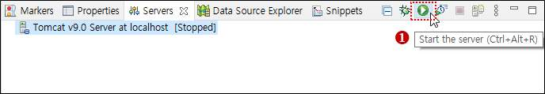</img>
<br></br>

#### [Started]로 변경되면 정상적으로 동작하는 것이다.

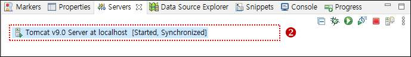</img>
<br></br>

#### **[Step5]** 
#### [Run As]를 실행한 다음 [Run on Server]를 실행한다. 

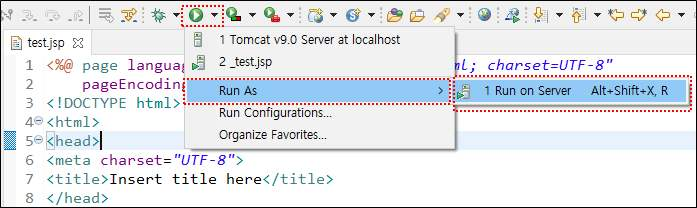</img>
<br></br>

#### **[Step6]** 
#### [Next] 버튼을 클릭한다. 

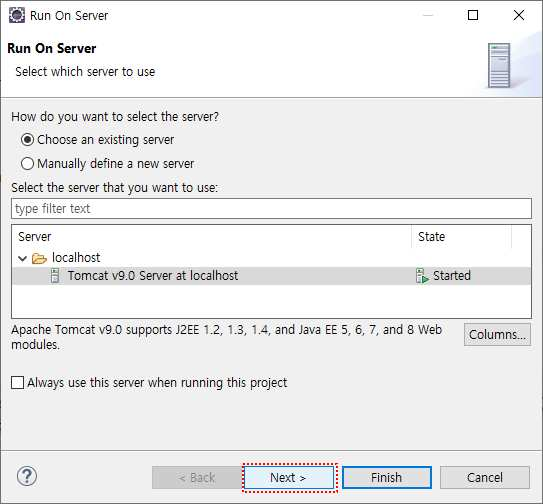</img>
<br></br>

#### **[Step7]** 
#### [Finish] 버튼을 클릭한다. 

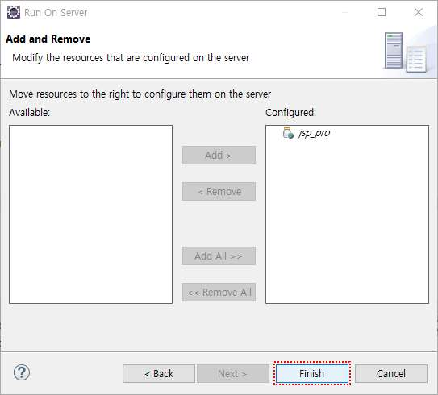</img>
<br></br>

#### **[Step8]** 
#### Server가 이미 동작된 상태에서는 아래와 같은 안내 창이 뜨므로 [OK] 버튼을 클릭한다.

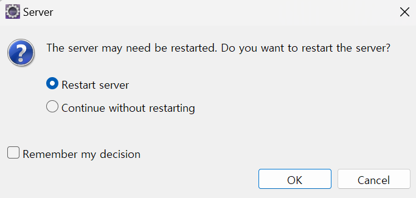</img>
<br></br>

#### **[Step9]** 
#### 수행 결과를 확인한다. 

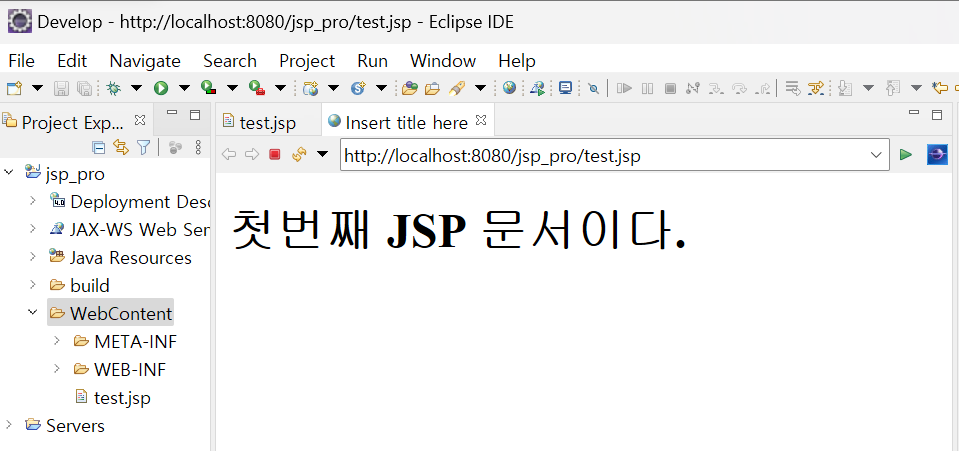</img>
<br></br>

---

<br></br>